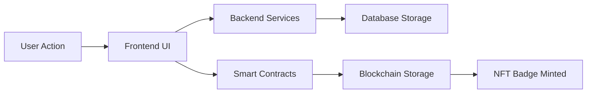

# Questlog - Complete Web3 Quest & Badge System

A comprehensive Web3 application for creating and managing quest-based achievements with soulbound NFT badges.

## 🏗️ Architecture Overview

This monorepo contains three main components:

- **[questlog-frontend](./questlog-frontend/)** - React/TypeScript web application
- **[questlog-backend](./questlog-backend/)** - TypeScript backend services and APIs  
- **[questlog-contracts](./questlog-contracts/)** - Solidity smart contracts (Foundry)

## 🚀 Quick Start

### 1. Install Dependencies

```bash
# Install all workspace dependencies
npm run install:all

# Or install individually
npm run install:frontend
npm run install:backend  
npm run install:contracts
```

### 2. Environment Setup

Copy environment templates and configure:

```bash
# Frontend environment
cp questlog-frontend/.env.example questlog-frontend/.env

# Backend environment  
cp questlog-backend/.env.example questlog-backend/.env

# Contracts environment
cp questlog-contracts/.env.example questlog-contracts/.env
```

### 3. Validate Setup

```bash
# Validate all environments and dependencies
npm run validate:all

# Or validate individually
npm run validate:env
npm run validate:deps
```

### 4. Development

```bash
# Start frontend development server
npm run dev:frontend

# Start backend development server
npm run dev:backend

# Deploy contracts (after configuring .env)
npm run deploy:contracts
```

## 🌐 Live Demo

- **Frontend**: [https://questlog-dapp.netlify.app](https://questlog-dapp.netlify.app)
- **Contracts**: [Lisk Sepolia Testnet](https://sepolia-blockscout.lisk.com/address/0xb4268cbf5e95a326646703a7435257899c151132)

## 🛠️ Technology Stack

### Frontend
- **Framework**: React 18 with TypeScript
- **Styling**: Tailwind CSS with custom components
- **Web3**: Wagmi + RainbowKit for wallet integration
- **Build**: Vite with optimized bundling
- **Deployment**: Vercel with automatic deployments

### Backend  
- **Runtime**: Node.js with TypeScript
- **Database**: Supabase (PostgreSQL with real-time)
- **Authentication**: Discord OAuth integration
- **Storage**: IPFS via Pinata for metadata
- **API**: RESTful services with type safety

### Smart Contracts
- **Language**: Solidity ^0.8.20
- **Framework**: Foundry for development and testing
- **Standards**: ERC721 with soulbound modifications
- **Network**: Lisk Sepolia (testnet), multi-chain ready
- **Features**: Non-transferable badges, quest verification

## 📦 Available Scripts

### Workspace Management
- `npm run install:all` - Install dependencies for all modules
- `npm run build:all` - Build all modules for production
- `npm run test:all` - Run all test suites
- `npm run lint:all` - Lint all TypeScript/Solidity code
- `npm run clean` - Clean all build artifacts and node_modules

### Validation & Setup
- `npm run validate:all` - Complete validation (environment + dependencies + build + test)
- `npm run validate:env` - Check all environment variables
- `npm run validate:deps` - Verify dependency compatibility
- `npm run setup:dev` - Complete development environment setup

### Individual Module Scripts
- `npm run dev:frontend` - Start frontend development server
- `npm run dev:backend` - Start backend development server  
- `npm run deploy:contracts` - Deploy smart contracts

## 🏢 Project Structure

```
questlog/
├── questlog-frontend/          # React web application
│   ├── src/
│   │   ├── components/         # Reusable UI components
│   │   ├── services/           # API and Web3 services
│   │   ├── types/              # TypeScript type definitions
│   │   └── utils/              # Helper utilities
│   ├── public/                 # Static assets
│   └── package.json
│
├── questlog-backend/           # Backend services
│   ├── services/               # Core business logic
│   │   ├── supabase.ts        # Database operations
│   │   ├── discord.ts         # Discord OAuth integration
│   │   └── ipfs.ts            # IPFS storage operations
│   ├── types/                  # Shared type definitions
│   └── package.json
│
├── questlog-contracts/         # Smart contracts
│   ├── src/                    # Solidity contracts
│   │   ├── QuestlogBadge.sol  # Soulbound NFT implementation
│   │   └── QuestMinter.sol    # Quest management contract
│   ├── script/                 # Deployment scripts
│   ├── test/                   # Contract tests
│   └── foundry.toml
│
├── scripts/                    # Workspace utilities
│   ├── validate-environment.js # Environment validation
│   └── validate-dependencies.js # Dependency checking
└── package.json                # Workspace configuration
```

## 🔗 Integration Flow

### Quest Creation & Completion
1. **Admin Panel** (Frontend) → Create quest via UI
2. **Backend Services** → Store quest data in Supabase
3. **Smart Contracts** → Deploy quest logic on blockchain
4. **User Interaction** → Complete quest requirements
5. **Verification** → Backend validates completion
6. **Badge Minting** → Smart contract mints soulbound NFT
7. **Cross-Device Sync** → Supabase syncs progress across devices

### Web2 ↔ Web3 Bridge
- **Authentication**: Discord OAuth for familiar login experience
- **Data Persistence**: Supabase for reliable cross-device synchronization  
- **Metadata Storage**: IPFS for decentralized badge metadata
- **Asset Ownership**: Blockchain for permanent, verifiable achievements
- **User Experience**: Seamless Web2 UX with Web3 benefits

## 🚀 Deployment

### Quick Deploy

Each module can be deployed independently:

- **Frontend**: [](https://vercel.com/new/clone?repository-url=https://github.com/kashiwagiren/Questlog/questlog-frontend)
- **Backend**: [](https://railway.app/new/template?template=https://github.com/kashiwagiren/Questlog/questlog-backend)
- **Contracts**: See [contracts deployment guide](./questlog-contracts/DEPLOYMENT.md)

### Production Setup

1. **Environment Configuration**
   ```bash
   npm run validate:env  # Ensure all variables are set
   ```

2. **Build Validation**
   ```bash
   npm run build:all     # Verify all modules build successfully
   npm run test:all      # Run complete test suite
   ```

3. **Deploy in Order**
   ```bash
   # 1. Deploy contracts first
   cd questlog-contracts && npm run deploy
   
   # 2. Deploy backend services
   # Use your preferred platform (Railway, Render, Vercel Functions)
   
   # 3. Deploy frontend
   # Update environment variables with contract addresses
   cd questlog-frontend && vercel --prod
   ```

For detailed deployment instructions, see:
- [Frontend Deployment](./questlog-frontend/VERCEL_DEPLOYMENT.md)
- [Backend Deployment](./questlog-backend/DEPLOYMENT.md)  
- [Contracts Deployment](./questlog-contracts/DEPLOYMENT.md)

## 🔒 Security & Best Practices

### Smart Contracts
- ✅ Soulbound token implementation (non-transferable)
- ✅ Owner-only minting with proper access controls
- ✅ Comprehensive test suite with 95%+ coverage
- ✅ Gas-optimized contract deployment

### Backend Security
- ✅ Supabase Row Level Security (RLS) policies
- ✅ Environment variable validation
- ✅ API rate limiting and input sanitization
- ✅ Secure Discord OAuth implementation

### Frontend Security  
- ✅ Type-safe API interactions
- ✅ Secure wallet connection handling
- ✅ Input validation and sanitization
- ✅ XSS prevention with proper escaping

## 🤝 Contributing

### Development Workflow

1. **Fork & Clone**
   ```bash
   git clone https://github.com/kashiwagiren/Questlog.git
   cd Questlog
   ```

2. **Setup Development Environment**
   ```bash
   npm run setup:dev
   ```

3. **Create Feature Branch**
   ```bash
   git checkout -b feature/your-feature-name
   ```

4. **Development**
   ```bash
   # Work on your feature
   npm run dev:frontend  # For frontend changes
   npm run dev:backend   # For backend changes
   ```

5. **Validation**
   ```bash
   npm run validate:all  # Ensure everything works
   npm run lint:all      # Fix any linting issues
   ```

6. **Submit Pull Request**

### Code Standards
- **TypeScript**: Strict mode enabled with comprehensive typing
- **Testing**: Maintain 90%+ test coverage
- **Linting**: ESLint + Prettier for consistent formatting
- **Documentation**: Update README files for any architectural changes

## 📚 Documentation

- **[Frontend Documentation](./questlog-frontend/README.md)** - Component architecture, API integration
- **[Backend Documentation](./questlog-backend/README.md)** - Service layer, database schema  
- **[Smart Contracts Documentation](./questlog-contracts/README.md)** - Contract interfaces, deployment
- **[API Documentation](./questlog-backend/API.md)** - RESTful endpoints and schemas

## 🐛 Troubleshooting

### Common Issues

1. **Build Failures**
   ```bash
   npm run clean          # Clean all artifacts
   npm run install:all    # Reinstall dependencies
   npm run validate:all   # Check configuration
   ```

2. **Environment Issues**
   ```bash
   npm run validate:env   # Check all environment variables
   ```

3. **Dependency Conflicts**
   ```bash
   npm run validate:deps  # Check version compatibility
   ```

### Getting Help

- **GitHub Issues**: [Report bugs and request features](https://github.com/kashiwagiren/Questlog/issues)
- **Documentation**: Check module-specific README files
- **Discord Community**: Join our development Discord server

## 📄 License

This project is licensed under the MIT License - see the [LICENSE](LICENSE) file for details.

## 🎯 Roadmap

### Phase 1: Core Platform ✅
- [x] Soulbound NFT badges
- [x] Quest creation and management
- [x] Discord OAuth integration
- [x] Cross-device synchronization
- [x] Web3 wallet integration

### Phase 2: Enhanced Features 🚧
- [ ] Multi-chain deployment (Ethereum, Polygon, Arbitrum)
- [ ] Guild/organization management
- [ ] Advanced quest types and verification
- [ ] Mobile application (React Native)
- [ ] API webhooks for external integrations

### Phase 3: Ecosystem Growth 🔮
- [ ] Third-party quest provider SDK
- [ ] Marketplace for quest templates
- [ ] Analytics dashboard for organizations
- [ ] Gamification features and leaderboards
- [ ] Integration with popular Web3 tools

---

**Built with ❤️ by the Questlog Team**

*Bridging Web2 familiarity with Web3 innovation for the next generation of digital achievements.* - Web3 Achievement Tracker Ecosystem

**A comprehensive Web3 quest and achievement system that bridges Web2 and Web3**

🌐 **[Live Demo](https://questlog.netlify.app)** | 📊 **[Smart Contracts](https://sepolia-blockscout.lisk.com/address/0xb4268cbf5e95a326646703a7435257899c151132)** | 🛠️ **[GitHub Organization](https://github.com/questlog)**

## 🌟 Project Overview

Questlog enables users to create quests, complete tasks, and earn permanent soulbound NFT badges stored on the blockchain, combining traditional quest mechanics with Web3 innovations.

### 🔗 Web2 + Web3 Integration

- **Web2 Features**: User-friendly React UI, Discord integration, cross-device sync, real-time updates
- **Web3 Features**: Wallet integration, smart contracts, soulbound NFT badges, on-chain storage
- **Hybrid Architecture**: Best of both worlds with seamless integration

## 🏗️ Ecosystem Architecture

```
┌─────────────────┐    ┌─────────────────┐    ┌─────────────────┐
│   Frontend      │    │   Backend       │    │ Smart Contracts │
│   (React/TS)    │────│   (Supabase)    │────│   (Solidity)    │
└─────────────────┘    └─────────────────┘    └─────────────────┘
        │                        │                        │
        │                        │                        │
        ▼                        ▼                        ▼
┌─────────────────┐    ┌─────────────────┐    ┌─────────────────┐
│ • UI Components │    │ • PostgreSQL DB │    │ • Soulbound NFTs│
│ • Quest Creation│    │ • Real-time Sync│    │ • Badge Minting │
│ • User Profiles │    │ • Discord OAuth │    │ • Lisk Blockchain│
│ • Web3 Wallet   │    │ • IPFS Storage  │    │ • Quest Validation│
└─────────────────┘    └─────────────────┘    └─────────────────┘
```

## 📁 Repository Structure

The Questlog ecosystem consists of three main repositories:

### 🎮 [questlog-frontend](https://github.com/questlog/questlog-frontend)
**React TypeScript Frontend Application**

- Modern React 18 + TypeScript + Vite setup
- Web3 integration with Wagmi & RainbowKit  
- Beautiful UI with Tailwind CSS
- Real-time backend integration
- Comprehensive quest management system

**🚀 [Live Demo](https://questlog.netlify.app)**

### 🗄️ [questlog-backend](https://github.com/questlog/questlog-backend)
**Database Services & API Layer**

- Supabase PostgreSQL with Row Level Security
- Real-time cross-device synchronization
- Discord OAuth and server verification
- IPFS integration for image storage
- TypeScript services for frontend integration

**Tech Stack**: Supabase, PostgreSQL, TypeScript, Discord API, IPFS

### ⛓️ [questlog-contracts](https://github.com/questlog/questlog-contracts)
**Blockchain Smart Contracts**

- Soulbound NFT badge system (ERC721)
- Quest completion verification
- Deployed on Lisk Sepolia testnet
- Built with Solidity + Foundry

**Live Contracts**: [View on Lisk Explorer](https://sepolia-blockscout.lisk.com/address/0xb4268cbf5e95a326646703a7435257899c151132)

## ✨ Key Features

### 🎮 Quest System
- **Advanced Creation**: 15+ configuration options for quest customization
- **Multiple Categories**: Social, gaming, learning, community quests
- **Flexible Requirements**: Manual verification, Discord server joining, custom tasks

### 🏆 Achievement System  
- **Soulbound NFT Badges**: Permanent, non-transferable proof of achievement
- **IPFS Metadata**: Decentralized storage for badge artwork and data
- **Cross-Device Sync**: Achievements accessible across all devices

### 🌐 Web3 Integration
- **Multi-Wallet Support**: MetaMask, WalletConnect, Coinbase Wallet, and more
- **Lisk Blockchain**: Fast, low-cost transactions on Lisk Sepolia
- **Real-time Updates**: Live blockchain event monitoring

### 👥 Social Features
- **Discord Integration**: OAuth authentication and server-based quests
- **User Profiles**: Comprehensive achievement showcasing
- **Community Quests**: Collaborative challenges and events

## 🚀 Quick Start Guide

### For Users
1. **Visit**: [questlog.netlify.app](https://questlog.netlify.app)
2. **Connect Wallet**: Use any Web3 wallet (MetaMask recommended)
3. **Create Quests**: Design custom challenges for the community
4. **Complete Tasks**: Earn soulbound NFT badges for achievements

### For Developers

#### Prerequisites
- **Node.js** 18+ and **npm**
- **Git** for repository management
- **Web3 Wallet** for testing
- **Supabase Account** (for backend setup)

#### Setup All Repositories

```bash
# Clone all repositories
git clone https://github.com/questlog/questlog-frontend.git
git clone https://github.com/questlog/questlog-backend.git  
git clone https://github.com/questlog/questlog-contracts.git

# Set up backend
cd questlog-backend
npm install
# Configure Supabase (see backend README)

# Set up frontend
cd ../questlog-frontend
npm install
npm run dev

# Set up contracts (optional)
cd ../questlog-contracts  
forge install
forge build
```

#### Environment Configuration

Each repository includes an `.env.example` file with required variables:

- **Frontend**: Supabase, Discord, IPFS, and contract addresses
- **Backend**: Supabase credentials and Discord OAuth settings
- **Contracts**: Private keys and RPC URLs for deployment

## 🔗 Integration Flow



1. **User Interaction**: Users interact with the React frontend
2. **Data Processing**: Quest data processed and stored in Supabase
3. **Blockchain Integration**: Badge minting triggered via smart contracts
4. **Permanent Storage**: Achievements stored as soulbound NFTs on Lisk

## 🌐 Live Deployment

### Frontend
- **Platform**: Netlify
- **URL**: [questlog.netlify.app](https://questlog.netlify.app)
- **Auto-Deploy**: Connected to GitHub for automatic deployments

### Smart Contracts  
- **Network**: Lisk Sepolia Testnet
- **QuestlogBadge**: `0xb4268cbf5e95a326646703a7435257899c151132`
- **QuestMinter**: `0x09f3dd43ba9f9efcffeea8e5632b0c9b71bed90c`
- **Explorer**: [Lisk Sepolia Blockscout](https://sepolia-blockscout.lisk.com/)

### Backend
- **Database**: Supabase PostgreSQL
- **Real-time**: WebSocket connections for live updates
- **Storage**: IPFS via Pinata for decentralized image storage

## �️ Technology Stack

| Component | Technologies |
|-----------|-------------|
| **Frontend** | React 18, TypeScript, Vite, Wagmi, RainbowKit, Tailwind CSS |
| **Backend** | Supabase, PostgreSQL, TypeScript, Discord API, IPFS |
| **Blockchain** | Solidity, Foundry, OpenZeppelin, Lisk Blockchain |
| **Deployment** | Netlify, Supabase Cloud, Lisk Sepolia |

## 🤝 Contributing

We welcome contributions to any part of the Questlog ecosystem!

### Getting Started
1. **Choose a repository** to contribute to
2. **Fork the repository** and create a feature branch
3. **Follow the setup instructions** in the respective README
4. **Make your changes** and ensure tests pass
5. **Submit a Pull Request** with a clear description

### Development Guidelines
- Follow TypeScript best practices
- Write comprehensive tests for new features
- Update documentation for any changes
- Ensure all linting and formatting checks pass

## 📄 License

All Questlog repositories are licensed under the **MIT License**.

- **questlog-frontend**: [MIT License](https://github.com/questlog/questlog-frontend/blob/main/LICENSE)
- **questlog-backend**: [MIT License](https://github.com/questlog/questlog-backend/blob/main/LICENSE)  
- **questlog-contracts**: [MIT License](https://github.com/questlog/questlog-contracts/blob/main/LICENSE)

## 🔗 Links

- **🌐 Live Application**: [questlog.netlify.app](https://questlog.netlify.app)
- **📊 Smart Contracts**: [Lisk Sepolia Explorer](https://sepolia-blockscout.lisk.com/address/0xb4268cbf5e95a326646703a7435257899c151132)
- **🛠️ GitHub Organization**: [github.com/questlog](https://github.com/questlog)
- **📖 Documentation**: Individual repository READMEs
- **🐛 Issues**: Report issues in the respective repository

---

**Built with ❤️ for the Web3 community by the Questlog Team**
