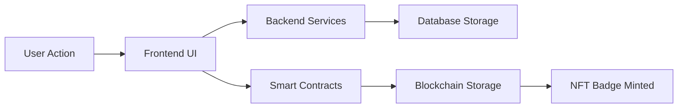

# Questlog

A comprehensive Web3 application for creating and managing quest-based achievements with soulbound NFT badges.

## 🏗️ Architecture Overview

This monorepo contains three main components:

- **[questlog-frontend](./questlog-frontend/)** - React/TypeScript web application
- **[questlog-contracts](./questlog-contracts/)** - Solidity smart contracts (Foundry)
- **[questlog-backend](./questlog-backend/)** - TypeScript backend services and APIs

## 🚀 Quick Start

### 1. Install Dependencies

```bash
# Install all workspace dependencies
npm run install:all

# Or install individually
npm run install:frontend
npm run install:backend  
npm run install:contracts
```

### 2. Environment Setup

Copy environment templates and configure:

```bash
# Frontend environment
cp questlog-frontend/.env.example questlog-frontend/.env

# Backend environment  
cp questlog-backend/.env.example questlog-backend/.env

# Contracts environment
cp questlog-contracts/.env.example questlog-contracts/.env
```

### 3. Validate Setup

```bash
# Validate all environments and dependencies
npm run validate:all

# Or validate individually
npm run validate:env
npm run validate:deps
```

### 4. Development

```bash
# Start frontend development server
npm run dev:frontend

# Start backend development server
npm run dev:backend

# Deploy contracts (after configuring .env)
npm run deploy:contracts
```

## 🛠️ Technology Stack

### Frontend
- **Framework**: React 18 with TypeScript
- **Styling**: Tailwind CSS with custom components
- **Web3**: Wagmi + RainbowKit for wallet integration
- **Build**: Vite with optimized bundling
- **Deployment**: Vercel with automatic deployments

### Backend  
- **Runtime**: Node.js with TypeScript
- **Database**: Supabase (PostgreSQL with real-time)
- **Authentication**: Discord OAuth integration
- **Storage**: IPFS via Pinata for metadata
- **API**: RESTful services with type safety

### Smart Contracts
- **Language**: Solidity ^0.8.20
- **Framework**: Foundry for development and testing
- **Standards**: ERC721 with soulbound modifications
- **Network**: Lisk Sepolia (testnet), multi-chain ready
- **Features**: Non-transferable badges, quest verification

## 📦 Available Scripts

### Workspace Management
- `npm run install:all` - Install dependencies for all modules
- `npm run build:all` - Build all modules for production
- `npm run test:all` - Run all test suites
- `npm run lint:all` - Lint all TypeScript/Solidity code
- `npm run clean` - Clean all build artifacts and node_modules

### Validation & Setup
- `npm run validate:all` - Complete validation (environment + dependencies + build + test)
- `npm run validate:env` - Check all environment variables
- `npm run validate:deps` - Verify dependency compatibility
- `npm run setup:dev` - Complete development environment setup

### Individual Module Scripts
- `npm run dev:frontend` - Start frontend development server
- `npm run dev:backend` - Start backend development server  
- `npm run deploy:contracts` - Deploy smart contracts

## 🏢 Project Structure

```
questlog/
├── questlog-frontend/          # React web application
│   ├── src/
│   │   ├── components/         # Reusable UI components
│   │   ├── services/           # API and Web3 services
│   │   ├── types/              # TypeScript type definitions
│   │   └── utils/              # Helper utilities
│   ├── public/                 # Static assets
│   └── package.json
│
├── questlog-backend/           # Backend services
│   ├── services/               # Core business logic
│   │   ├── supabase.ts        # Database operations
│   │   ├── discord.ts         # Discord OAuth integration
│   │   └── ipfs.ts            # IPFS storage operations
│   ├── types/                  # Shared type definitions
│   └── package.json
│
├── questlog-contracts/         # Smart contracts
│   ├── src/                    # Solidity contracts
│   │   ├── QuestlogBadge.sol  # Soulbound NFT implementation
│   │   └── QuestMinter.sol    # Quest management contract
│   ├── script/                 # Deployment scripts
│   ├── test/                   # Contract tests
│   └── foundry.toml
│
├── scripts/                    # Workspace utilities
│   ├── validate-environment.js # Environment validation
│   └── validate-dependencies.js # Dependency checking
└── package.json                # Workspace configuration
```

## 🔗 Integration Flow

### Quest Creation & Completion
1. **Admin Panel** (Frontend) → Create quest via UI
2. **Backend Services** → Store quest data in Supabase
3. **Smart Contracts** → Deploy quest logic on blockchain
4. **User Interaction** → Complete quest requirements
5. **Verification** → Backend validates completion
6. **Badge Minting** → Smart contract mints soulbound NFT
7. **Cross-Device Sync** → Supabase syncs progress across devices

### Web2 ↔ Web3 Bridge
- **Authentication**: Discord OAuth for familiar login experience
- **Data Persistence**: Supabase for reliable cross-device synchronization  
- **Metadata Storage**: IPFS for decentralized badge metadata
- **Asset Ownership**: Blockchain for permanent, verifiable achievements
- **User Experience**: Seamless Web2 UX with Web3 benefits

### Production Setup

1. **Environment Configuration**
   ```bash
   npm run validate:env  # Ensure all variables are set
   ```

2. **Build Validation**
   ```bash
   npm run build:all     # Verify all modules build successfully
   npm run test:all      # Run complete test suite
   ```

3. **Deploy in Order**
   ```bash
   # 1. Deploy contracts first
   cd questlog-contracts && npm run deploy
   
   # 2. Deploy backend services
   # Use your preferred platform (Railway, Render, Vercel Functions)
   
   # 3. Deploy frontend
   # Update environment variables with contract addresses
   cd questlog-frontend && vercel --prod
   ```

For detailed deployment instructions, see:
- [Frontend Deployment](./questlog-frontend/VERCEL_DEPLOYMENT.md)
- [Backend Deployment](./questlog-backend/DEPLOYMENT.md)

## 🔒 Security & Best Practices

### Smart Contracts
- ✅ Soulbound token implementation (non-transferable)
- ✅ Owner-only minting with proper access controls
- ✅ Comprehensive test suite with 95%+ coverage
- ✅ Gas-optimized contract deployment

### Backend Security
- ✅ Supabase Row Level Security (RLS) policies
- ✅ Environment variable validation
- ✅ API rate limiting and input sanitization
- ✅ Secure Discord OAuth implementation

### Frontend Security  
- ✅ Type-safe API interactions
- ✅ Secure wallet connection handling
- ✅ Input validation and sanitization
- ✅ XSS prevention with proper escaping

## 🤝 Contributing

### Development Workflow

1. **Fork & Clone**
   ```bash
   git clone https://github.com/kashiwagiren/Questlog.git
   cd Questlog
   ```

2. **Setup Development Environment**
   ```bash
   npm run setup:dev
   ```

3. **Create Feature Branch**
   ```bash
   git checkout -b feature/your-feature-name
   ```

4. **Development**
   ```bash
   # Work on your feature
   npm run dev:frontend  # For frontend changes
   npm run dev:backend   # For backend changes
   ```

5. **Validation**
   ```bash
   npm run validate:all  # Ensure everything works
   npm run lint:all      # Fix any linting issues
   ```

6. **Submit Pull Request**

### Code Standards
- **TypeScript**: Strict mode enabled with comprehensive typing
- **Testing**: Maintain 90%+ test coverage
- **Linting**: ESLint + Prettier for consistent formatting
- **Documentation**: Update README files for any architectural changes

## 📚 Documentation

- **[Frontend Documentation](./questlog-frontend/README.md)** - Component architecture, API integration
- **[Backend Documentation](./questlog-backend/README.md)** - Service layer, database schema  
- **[Smart Contracts Documentation](./questlog-contracts/README.md)** - Contract interfaces, deployment

## 🐛 Troubleshooting

### Common Issues

1. **Build Failures**
   ```bash
   npm run clean          # Clean all artifacts
   npm run install:all    # Reinstall dependencies
   npm run validate:all   # Check configuration
   ```

2. **Environment Issues**
   ```bash
   npm run validate:env   # Check all environment variables
   ```

3. **Dependency Conflicts**
   ```bash
   npm run validate:deps  # Check version compatibility
   ```

### Getting Help

- **GitHub Issues**: [Report bugs and request features](https://github.com/kashiwagiren/Questlog/issues)
- **Documentation**: Check module-specific README files
- **Discord Community**: Join our development Discord server

## 📄 License

This project is licensed under the MIT License.

## 🎯 Roadmap

### Phase 1: Core Platform ✅
- [x] Soulbound NFT badges
- [x] Quest creation and management
- [x] Discord OAuth integration
- [x] Cross-device synchronization
- [x] Web3 wallet integration

### Phase 2: Enhanced Features 🚧
- [ ] Multi-chain deployment (Ethereum, Polygon, Arbitrum)
- [ ] Guild/organization management
- [ ] Advanced quest types and verification
- [ ] Mobile application (React Native)
- [ ] API webhooks for external integrations

### Phase 3: Ecosystem Growth 🔮
- [ ] Third-party quest provider SDK
- [ ] Marketplace for quest templates
- [ ] Analytics dashboard for organizations
- [ ] Gamification features and leaderboards
- [ ] Integration with popular Web3 tools

## 🌟 Project Overview

Questlog enables users to create quests, complete tasks, and earn permanent soulbound NFT badges stored on the blockchain, combining traditional quest mechanics with Web3 innovations.

### 🔗 Web2 + Web3 Integration

- **Web2 Features**: User-friendly React UI, Discord integration, cross-device sync, real-time updates
- **Web3 Features**: Wallet integration, smart contracts, soulbound NFT badges, on-chain storage
- **Hybrid Architecture**: Best of both worlds with seamless integration

## 🏗️ Ecosystem Architecture

```
┌─────────────────┐    ┌─────────────────┐    ┌─────────────────┐
│   Frontend      │    │   Backend       │    │ Smart Contracts │
│                 │────│   (Supabase)    │────│   (Solidity)    │
└─────────────────┘    └─────────────────┘    └─────────────────┘
        │                        │                        │
        │                        │                        │
        ▼                        ▼                        ▼
┌─────────────────┐    ┌─────────────────┐    ┌───────────────────┐
│ • UI Components │    │ • PostgreSQL DB │    │ • Soulbound NFTs  │
│ • Quest Creation│    │ • Real-time Sync│    │ • Badge Minting   │
│ • User Profiles │    │ • Discord OAuth │    │ • Lisk Blockchain │
│ • Web3 Wallet   │    │ • IPFS Storage  │    │ • Quest Validation│
└─────────────────┘    └─────────────────┘    └───────────────────┘
```

## 🔗 Integration Flow



1. **User Interaction**: Users interact with the React frontend
2. **Data Processing**: Quest data processed and stored in Supabase
3. **Blockchain Integration**: Badge minting triggered via smart contracts
4. **Permanent Storage**: Achievements stored as soulbound NFTs on Lisk

---

**Built with ❤️ for the Web3 community by the Questlog Team**
