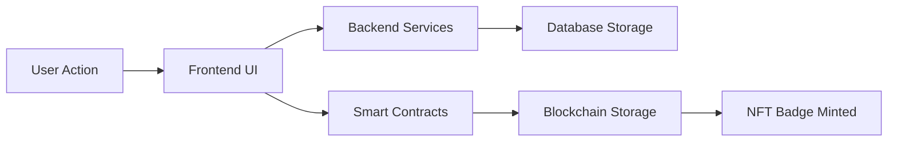

# Questlog  

A comprehensive **Web3 application** for creating and managing quest-based achievements with **soulbound NFT badges**.  

## 🏗️ Architecture Overview  

This monorepo consists of three main components:  
- **[questlog-frontend](./questlog-frontend/)** – React/TypeScript web application  
- **[questlog-contracts](./questlog-contracts/)** – Solidity smart contracts (Foundry)  
- **[questlog-backend](./questlog-backend/)** – TypeScript backend services and APIs  

## 🚀 Quick Start  

### 1️⃣ Install Dependencies  
```bash
npm run install:all   # Install all dependencies
```

### 2️⃣ Set Up Environments  
```bash
cp questlog-frontend/.env.example questlog-frontend/.env
cp questlog-backend/.env.example questlog-backend/.env
cp questlog-contracts/.env.example questlog-contracts/.env
```

### 3️⃣ Validate Setup  
```bash
npm run validate:all   # Check envs, dependencies, and build
```

### 4️⃣ Start Development  
```bash
npm run dev:frontend   # Frontend dev server
npm run dev:backend    # Backend dev server
npm run deploy:contracts  # Deploy contracts
```

## 🛠️ Tech Stack  

| Layer        | Technologies |
|-------------|-------------|
| **Frontend** | React 18, TypeScript, Vite, Wagmi, RainbowKit, Tailwind CSS |
| **Backend**  | Supabase, PostgreSQL, Discord API, IPFS |
| **Blockchain** | Solidity, Foundry, OpenZeppelin, Lisk |
| **Deployment** | Netlify, Supabase Cloud, Lisk Sepolia |

## 📦 Available Scripts  

- `npm run install:all` – Install dependencies across modules  
- `npm run build:all` – Build for production  
- `npm run test:all` – Run tests  
- `npm run lint:all` – Lint codebase  
- `npm run clean` – Clear builds & node_modules  
- `npm run validate:all` – Full validation (env, deps, build, tests)  
- `npm run setup:dev` – Complete development setup  
- `npm run dev:frontend` / `npm run dev:backend` – Start dev servers  
- `npm run deploy:contracts` – Deploy smart contracts  

## 🏢 Project Structure  

```
questlog/
├── questlog-frontend/    # React app (UI, services, types)
├── questlog-backend/     # Backend (Supabase, Discord, IPFS)
├── questlog-contracts/   # Smart contracts (Solidity)
├── scripts/              # Validation utilities
└── package.json          # Monorepo config
```

## 🌉 Web2 ↔ Web3 Bridge  

- **Discord OAuth** for authentication  
- **Supabase** for synced user data  
- **IPFS** for decentralized metadata  
- **Blockchain** for permanent proof of achievement  
- **Seamless UX** blending Web2 familiarity with Web3 ownership  

## 🔗 Integration Flow  



1. **User Interaction**: Users interact with the React frontend.  
2. **Data Processing**: Quest data processed and stored in Supabase.  
3. **Blockchain Integration**: Badge minting triggered via smart contracts.  
4. **Permanent Storage**: Achievements stored as soulbound NFTs on Lisk.  

## 🚢 Production Deployment  

1. **Validate Environment**  
```bash
npm run validate:env
```

2. **Build & Test**  
```bash
npm run build:all
npm run test:all
```

3. **Deploy (Order Matters)**  
   1. **Contracts** → `cd questlog-contracts && npm run deploy`  
   2. **Backend** → Deploy via Railway, Render, or Vercel  
   3. **Frontend** → `cd questlog-frontend && vercel --prod`  

(See detailed deployment guides in module READMEs.)

## 🔒 Security & Best Practices  

- **Smart Contracts:** Soulbound tokens, strict owner minting, 95%+ test coverage  
- **Backend:** Supabase RLS, env validation, API rate limits, secure OAuth  
- **Frontend:** Type-safe API calls, wallet security, XSS prevention  

## 🤝 Contributing  

1. **Fork & Clone**  
```bash
git clone https://github.com/kashiwagiren/Questlog.git && cd Questlog
```
2. **Setup Dev Environment** – `npm run setup:dev`  
3. **Create Feature Branch** – `git checkout -b feature/your-feature`  
4. **Develop & Run Dev Servers** – `npm run dev:frontend` / `npm run dev:backend`  
5. **Validate & Lint** – `npm run validate:all && npm run lint:all`  
6. **Submit Pull Request**  

### Code Standards  
✅ Strict TypeScript mode  
✅ 90%+ test coverage  
✅ ESLint + Prettier formatting  
✅ Updated documentation with every architectural change

## 🐛 Troubleshooting  

- **Build Issues:**  
```bash
npm run clean && npm run install:all && npm run validate:all
```
- **Dependency Conflicts:**  
```bash
npm run validate:deps
```

## 🎯 Roadmap  

### ✅ Phase 1 – Core Platform  
- Soulbound NFT badges  
- Quest creation & management  
- Discord OAuth integration  

### 🚧 Phase 2 – Feature Growth  
- Multi-chain deployment  
- Advanced quests & verification  
- Mobile app (React Native)  

### 🔮 Phase 3 – Ecosystem  
- Quest provider SDK  
- Template marketplace

---

## 📄 License

MIT License

---

## 🔗 Related Projects

* [Questlog Frontend](../questlog-frontend)
* [Questlog Contracts](../questlog-contracts)
* [Questlog Backend](../questlog-backend)

**Built with ❤️ for the Web3 community**
